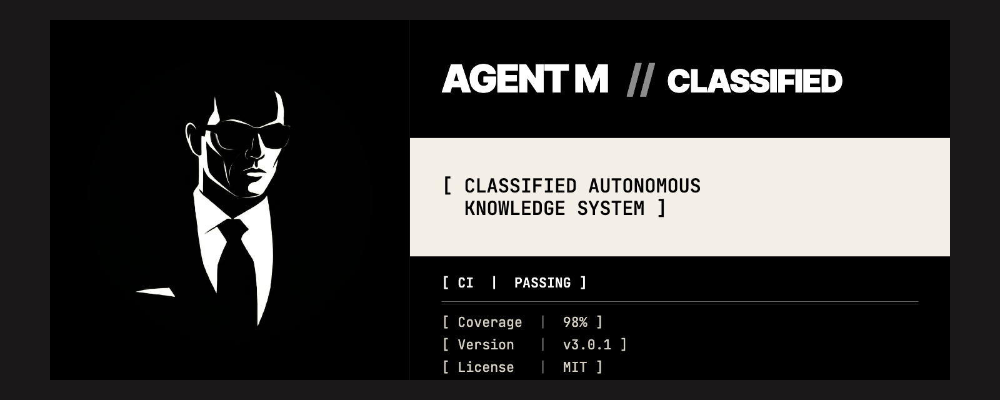

<p align="center">
  
</p>

<p align="center"><em>The agent harness that gives you the assistant you want — part Star Trek Computer, part J.A.R.V.I.S.</em></p>

<!--
  Badge convention (plan #15 task 6 v2) — apply uniformly across the brand-system:
    labelColor = 0a0a0a (ink, brand)
    color      = auto (semantic green/red on CI; semver-colored on release)
                 OR f4efe6 (paper) for state-less metadata (e.g. LICENSE)
    style      = for-the-badge (brutalist, ALL CAPS, sharp corners — matches banner motif)
    logo       = github (logoColor f4efe6) on CI + release badges
  CI badge points at the dedicated `ci-all.yml` aggregator workflow which waits
  for the 3 per-OS workflows on the same commit and reports a combined status.
  This insulates the badge from other apps' check suites (e.g. installed GitHub Apps
  that queue but never complete checks). Compatibility lives at wiki/reference/Compatibility.md.
  Mirrored on the Crickets README via task 7. Documented in PLAN.md task 7.
-->

<p align="center">
  <a href="https://github.com/alexherrero/agentm/actions/workflows/ci-all.yml"></a>
  <a href="https://github.com/alexherrero/agentm/releases/latest"></a>
  <a href="LICENSE"></a>
</p>

<p align="center"><sub>Works with Claude Code + Antigravity — <a href="https://github.com/alexherrero/agentm/wiki/Compatibility">see compatibility</a></sub></p>

Think of **Agent M** as the structural backend harness you wished you had—part Star Trek Computer, part J.A.R.V.I.S.-level contextual autonomy, engineered to manage your projects, memory, and persistent knowledge across any modern agent surface, gaining experience and self-improving as it goes.

Imagine those workflows you saw in the movies. You're talking to your agent, *"open a new project file for M"* and off you go. Agent M remembers your projects and files together, talks with you about them, and learns and grows with you as you work. The context is self-maintaining — no time spent curating your own knowledge graph, and it can help with your personal notes too when **you** want it to.

This repo is the **harness** — the phase-gated workflow, auto-recall hooks, sub-agents, and on-disk state that make Agent M a system instead of a folder of files. It pairs with [**Crickets**](https://github.com/alexherrero/crickets) — a tactical suite of agent primitives (skills, hooks, sub-agents, bundles) that acts as the execution engine the harness installs into your target projects.

> **Latest:** v3.0.1 (2026-05-24) — Agent M V3 close-out + brand pass.  
> [Release notes](https://github.com/alexherrero/agentm/releases/latest) · [Agent M Evolution HLD](https://github.com/alexherrero/crickets/blob/main/wiki/explanation/designs/agent-memory-evolution.md) · [CHANGELOG](CHANGELOG.md)

## What's where

| Piece | What it is |
|---|---|
| **Agent M** | The system as a whole — this repo + Crickets + your AgentMemory vault folder, working together |
| **Harness** (this repo) | Phase-gated workflow (`/setup` `/plan` `/work` `/review` `/release` `/bugfix`) + auto-recall + sub-agents + scripts |
| **Crickets** ([`crickets`](https://github.com/alexherrero/crickets)) | Skills, hooks, sub-agents, bundles — the primitives you install into your projects |
| **AgentMemory vault** | Your Obsidian markdown folder (synced via Google Drive / Dropbox / etc.) — agent reads at session start, writes under controlled conditions |

Agent M is opinionated — small, not a 150-agent supermarket. It works with YOLO mode and other fully automated coding workflows, but it's designed for the ones that keep a human in the loop.

## Why Agent M?

|  | Vanilla Claude Code | Claude Code + Agent M |
|---|---|---|
| **Session continuity** | Memory ends with the session; the next prompt starts blank | Vault-backed; new sessions auto-recall the entries relevant to where you left off |
| **Per-phase auto-context** | You re-explain conventions every time, or rely on a static `CLAUDE.md` | Each phase (`/setup` `/plan` `/work` `/review` `/release`) recalls phase-scoped entries within a token budget |
| **Evidence-tracked task closeouts** | Tasks close when the agent says they're done | `evidence-tracker` hook blocks `[ ] → [x]` flips in `PLAN.md` unless the agent actually read the spec/test files first |
| **Paired-release coordination** | Manual cross-repo coordination per release | Locked release-order convention + URL-linked sibling release notes + paired CI verification on both repos |
| **Cross-project memory** | Each project's `CLAUDE.md` lives in isolation | Vault holds operator-wide conventions + per-project sub-trees; the same locked decisions surface across every project you work in |

Agent M doesn't replace Claude Code — it gives it persistence, structure, and the kind of accumulating context that turns a fresh session into a continuation.

## Get started

Once both repos are cloned and the vault folder exists, Agent M is operational.

**1. Install both repos as siblings**

```bash
git clone https://github.com/alexherrero/agentm.git ~/Antigravity/agentm
git clone https://github.com/alexherrero/crickets.git    ~/Antigravity/crickets
```

**2. Point the vault at your existing Obsidian + sync setup**

```bash
mkdir -p "<sync-root>/AgentMemory/personal-private/_always-load"
mkdir -p "<sync-root>/AgentMemory/personal-projects"
mkdir -p "<sync-root>/AgentMemory/_meta"
export MEMORY_VAULT_PATH="<sync-root>/AgentMemory"
```

Any sync layer works (Google Drive, Dropbox, syncthing).

**3. Install the harness + Crickets bundle into your target project**

```bash
# Harness (this repo) — slash commands, sub-agents, .harness/ state, AGENTS.md / CLAUDE.md, wiki/ scaffold
bash ~/Antigravity/agentm/install.sh [--hooks] /path/to/your-project

# Crickets bundle — evaluator sub-agent + 4 base hooks (kill-switch, steer, commit-on-stop, evidence-tracker) in one operation
bash ~/Antigravity/crickets/install.sh /path/to/your-project --bundle quality-gates

# Memory skill — /memory save / evolve / reflect / search / etc.
bash ~/Antigravity/crickets/install.sh /path/to/your-project --skill memory
```

Installations are idempotent; `--hooks` is opt-in for verification hooks. Windows: use `install.ps1` with PowerShell 7+; same flag shape with `-Hooks` and `-Update`.

<details>
<summary>More install detail — seed your always-load entries + verify</summary>

**4. Seed your always-load entries**

Capture your locked conventions, coding-style rules, project invariants under `<vault>/personal-private/_always-load/`. One entry per concern. The first pass is co-created — you and the agent walk through it together; you approve each entry.

**5. Verify**

```bash
python3 ~/Antigravity/agentm/scripts/harness_memory.py recall --phase setup
```

Should print your always-load entries within the 4000-token budget.

</details>

Full install detail: [wiki/how-to/Install-Into-Project.md](wiki/how-to/Install-Into-Project.md).

## How it works


## Phases

| Command | Purpose |
|---|---|
| `/setup` | First-time project init — scaffold, `init.sh`, feature list, vault recall |
| `/plan` | Turn a brief into `.harness/PLAN.md` — tasks with pass/fail criteria |
| `/work` | Execute one task from the plan; evidence-tracked; update progress; stop |
| `/review` | Adversarial critique of the change — must produce executable artifact |
| `/release` | Pre-merge gate — clean tree, verification passes, changelog, paired-release coordination |
| `/bugfix` | Report → Analyze → Fix → Verify pipeline with GitHub Issue as posterity record |

Every phase auto-recalls relevant entries from your AgentMemory vault at start, and offers to save new durable knowledge at exit. Self-modulating offer-save (confidence-thresholded) and cursor-tracked promotion keep the vault current without nagging you.

## Skills shipped with the harness

| Skill | What it does |
|---|---|
| [`migrate-to-diataxis`](harness/skills/migrate-to-diataxis.md) | One-shot migration of an already-installed project's `wiki/` to the Diátaxis four-mode layout. Preview-first, `git mv` for blame, non-destructive. (Superseded by Crickets' `diataxis-author` skill for new work; kept for legacy migration.) |
| [`doctor`](harness/skills/doctor.md) | User-invoked (`/doctor`). Verifies the install is correctly wired up in this host — structural by default, `--live` adds real sub-agent dispatches and skill dry-runs. |

Personal customizations — skills, sub-agents, hooks, MCP servers, bundles — live in **Crickets**. See [ADR 0006](wiki/explanation/decisions/0006-crickets-split.md) for the split.

## Telemetry

`.harness/progress.md` accumulates evidence of whether the harness is working. Run `.harness/scripts/telemetry.sh` for a per-project report or `--all` for multi-project. Signal definitions in [harness/telemetry.md](harness/telemetry.md).

## Repo structure

<details>
<summary>Top-level layout</summary>

```text
agentm/
├── harness/          # canonical phase specs + harness-shipped skills (doctor, migrate-to-diataxis) + telemetry doc + principles
├── adapters/         # per-host wiring (claude-code/, antigravity/) — thin shims that point back at the canonical specs in harness/
├── wiki/             # Diátaxis-shaped docs (tutorials/ + how-to/ + reference/ + explanation/) — published as the GitHub Wiki
├── scripts/          # install helpers + smoke tests + harness_memory.py + manifest validators
├── templates/        # scaffolding (PLAN.md template, init.sh template) installed into target projects
├── assets/           # Agent M brand assets — logo, monogram, brand preview
├── lib/              # shared install plumbing — byte-identical to Crickets' lib/install/
├── AGENTS.md         # universal instructions for any AGENTS.md-aware host
├── CLAUDE.md         # Claude Code entry point — points back at AGENTS.md
├── install.sh        # POSIX installer (Linux + Mac)
└── install.ps1       # Windows installer (PowerShell 7+)
```

</details>

## Architecture history

Agent M has grown over time across paired releases of `agentm` and `crickets`. The full V1→V4 evolution — what shipped, what's deferred, where the design is going — lives in [Agent Memory Evolution](https://github.com/alexherrero/crickets/blob/main/wiki/explanation/designs/agent-memory-evolution.md) on the Crickets side. [V3 Retrospective](https://github.com/alexherrero/crickets/blob/main/wiki/explanation/v3-retrospective.md) covers what shipped, what we learned, what's deferred.

For the harness's design rationale, see [harness/principles.md](harness/principles.md) and the architecture decisions under [wiki/explanation/decisions/](wiki/explanation/decisions/).

## Status

Currently shipping **v3.0.1** — see [CHANGELOG.md](CHANGELOG.md) and the [latest release](https://github.com/alexherrero/agentm/releases/latest). Releases and release notes are the source of truth; the harness ships in lockstep with Crickets as paired releases.

## Contributing

Self-tested on every push by three per-OS workflows (Linux, Mac, Windows) running in parallel. Run the same gates locally with `bash scripts/smoke-install-bash.sh`. Details and the full invariant list in [CONTRIBUTING.md](CONTRIBUTING.md).
