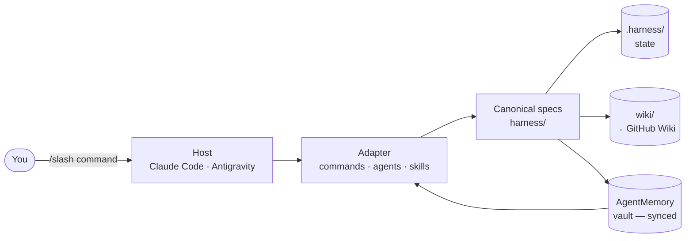

<p align="center">
  
</p>

<h1 align="center">Agent M</h1>

<p align="center"><em>Persistent agentic memory + phase-gated engineering harness.</em></p>

<p align="center">
  <a href="https://github.com/alexherrero/agentic-harness/actions/workflows/tests-linux.yml"></a>
  <a href="https://github.com/alexherrero/agentic-harness/actions/workflows/tests-mac.yml"></a>
  <a href="https://github.com/alexherrero/agentic-harness/actions/workflows/tests-windows.yml"></a>
  <a href="https://github.com/alexherrero/agentic-harness/releases/latest"></a>
  <a href="LICENSE"></a>
</p>

<p align="center">
  <a href="adapters/claude-code/"></a>
  <a href="adapters/antigravity/"></a>
</p>

**Agent M** is an agentic memory implementation that combines a persistent knowledge layer with personally curated content (i.e. your own notes in markdown format) through a combination of skills, sidecars, and vectorized indexing. Imagine those workflows you saw in the movies. You're talking to your agent, *"open a new project file for M"* and off you go. It remembers your projects and files together, talks to you about them, and learns and grows with you as you work. The context it builds is self-maintaining and improves automatically as you go. No need to spend time maintaining your own knowledge graphs, and it can help you with your personal notes too, when **you** want it to.

This repo is the **harness** — the phase-gated workflow, auto-recall hooks, sub-agents, and on-disk state that make Agent M a system instead of a folder of files. Sibling repo [Cricket (`agent-toolkit`)](https://github.com/alexherrero/agent-toolkit) ships the small-but-powerful primitives (skills, hooks, sub-agents, bundles) that the harness installs into your target projects.

## What's where

| Piece | What it is |
|---|---|
| **Agent M** | The system as a whole — this repo + Cricket + your AgentMemory vault folder, working together |
| **Harness** (this repo) | Phase-gated workflow (`/setup` `/plan` `/work` `/review` `/release` `/bugfix`) + auto-recall + sub-agents + scripts |
| **Cricket** ([`agent-toolkit`](https://github.com/alexherrero/agent-toolkit)) | Skills, hooks, sub-agents, bundles — the primitives you install into your projects |
| **AgentMemory vault** | Your Obsidian markdown folder (synced via Google Drive / Dropbox / etc.) — agent reads at session start, writes under controlled conditions |

The harness has earned its opinionated identity — small, not a 150-agent supermarket. While it can be used with YOLO mode and other fully automated coding workflows, it's intended for workflows that keep a human in the loop.

## Get started

Once both repos are cloned and the vault folder exists, Agent M is operational.

**1. Install both repos as siblings**

```bash
git clone https://github.com/alexherrero/agentic-harness.git ~/Antigravity/agentic-harness
git clone https://github.com/alexherrero/agent-toolkit.git    ~/Antigravity/agent-toolkit
```

**2. Point the vault at your existing Obsidian + sync setup**

```bash
mkdir -p "<sync-root>/AgentMemory/personal-private/_always-load"
mkdir -p "<sync-root>/AgentMemory/personal-projects"
mkdir -p "<sync-root>/AgentMemory/_meta"
export MEMORY_VAULT_PATH="<sync-root>/AgentMemory"
```

Any sync layer works (Google Drive, Dropbox, syncthing).

**3. Install the harness + Cricket bundle into your target project**

```bash
# Harness (this repo) — slash commands, sub-agents, .harness/ state, AGENTS.md / CLAUDE.md, wiki/ scaffold
bash ~/Antigravity/agentic-harness/install.sh [--hooks] /path/to/your-project

# Cricket bundle — evaluator sub-agent + 4 base hooks (kill-switch, steer, commit-on-stop, evidence-tracker) in one operation
bash ~/Antigravity/agent-toolkit/install.sh /path/to/your-project --bundle quality-gates

# Memory skill — /memory save / evolve / reflect / search / etc.
bash ~/Antigravity/agent-toolkit/install.sh /path/to/your-project --skill memory
```

Installations are idempotent; `--hooks` is opt-in for verification hooks. Windows: use `install.ps1` with PowerShell 7+; same flag shape with `-Hooks` and `-Update`.

**4. Seed your always-load entries**

Capture your locked conventions, coding-style rules, project invariants under `<vault>/personal-private/_always-load/`. One entry per concern. The first pass is co-created — you and the agent walk through it together; you approve each entry.

**5. Verify**

```bash
python3 ~/Antigravity/agentic-harness/scripts/harness_memory.py recall --phase setup
```

Should print your always-load entries within the 4000-token budget.

Full install detail: [wiki/how-to/Install-Into-Project.md](wiki/how-to/Install-Into-Project.md).

## How it works



## Phases

| Command | Purpose |
|---|---|
| `/setup` | First-time project init — scaffold, `init.sh`, feature list, vault recall |
| `/plan` | Turn a brief into `.harness/PLAN.md` — tasks with pass/fail criteria |
| `/work` | Execute one task from the plan; evidence-tracked; update progress; stop |
| `/review` | Adversarial critique of the change — must produce executable artifact |
| `/release` | Pre-merge gate — clean tree, verification passes, changelog, paired-release coordination |
| `/bugfix` | Report → Analyze → Fix → Verify pipeline with GitHub Issue as posterity record |

Every phase auto-recalls relevant entries from your AgentMemory vault at start, and offers to save new durable knowledge at exit. Self-modulating offer-save (confidence-thresholded) and cursor-tracked promotion keep the vault current without nagging you.

## Skills shipped with the harness

| Skill | What it does |
|---|---|
| [`migrate-to-diataxis`](harness/skills/migrate-to-diataxis.md) | One-shot migration of an already-installed project's `wiki/` to the Diátaxis four-mode layout. Preview-first, `git mv` for blame, non-destructive. (Superseded by Cricket's `diataxis-author` skill for new work; kept for legacy migration.) |
| [`doctor`](harness/skills/doctor.md) | User-invoked (`/doctor`). Verifies the install is correctly wired up in this host — structural by default, `--live` adds real sub-agent dispatches and skill dry-runs. |

Personal customizations (skills, sub-agents, hooks, MCP servers, bundles) live in [Cricket](https://github.com/alexherrero/agent-toolkit) — see [ADR 0006](wiki/explanation/decisions/0006-agent-toolkit-split.md) for the split.

## Telemetry

`.harness/progress.md` accumulates evidence of whether the harness is working. Run `.harness/scripts/telemetry.sh` for a per-project report or `--all` for multi-project. Signal definitions in [harness/telemetry.md](harness/telemetry.md).

## Architecture history

Agent M has grown over time across paired releases of `agentic-harness` and `agent-toolkit`. The full V1→V4 evolution — what shipped, what's deferred, where the design is going — lives in [Agent Memory Evolution](https://github.com/alexherrero/agent-toolkit/blob/main/wiki/explanation/designs/agent-memory-evolution.md) on the Cricket side. [V3 Retrospective](https://github.com/alexherrero/agent-toolkit/blob/main/wiki/explanation/v3-retrospective.md) covers what shipped, what we learned, what's deferred.

For the harness's design rationale, see [harness/principles.md](harness/principles.md) and the architecture decisions under [wiki/explanation/decisions/](wiki/explanation/decisions/).

## Status

Currently shipping **v3.0.0** — see [CHANGELOG.md](CHANGELOG.md) and the [latest release](https://github.com/alexherrero/agentic-harness/releases/latest). Releases and release notes are the source of truth; the harness ships in lockstep with Cricket as paired releases.

## Contributing

Self-tested on every push by three per-OS workflows (Linux, Mac, Windows) running in parallel. Run the same gates locally with `bash scripts/smoke-install-bash.sh`. Details and the full invariant list in [CONTRIBUTING.md](CONTRIBUTING.md).
