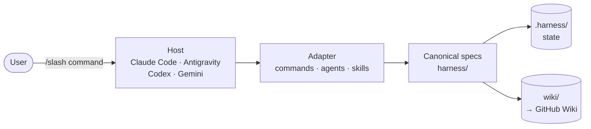

# agentic-harness

[](https://github.com/alexherrero/agentic-harness/actions/workflows/tests-linux.yml)
[](https://github.com/alexherrero/agentic-harness/actions/workflows/tests-mac.yml)
[](https://github.com/alexherrero/agentic-harness/actions/workflows/tests-windows.yml)
[](https://github.com/alexherrero/agentic-harness/releases/latest)
[](LICENSE)

A small, opinionated harness for doing production-quality engineering with AI coding agents. Works with Claude Code, Antigravity, Codex, Gemini-CLI, and tools that read `AGENTS.md`).

This harness follows established principles from research to help improve code quality and consistency when coding with Agents. While it can be used with YOLO mode and other fully automated coding workflows, it is intended more for workflows that keep a human in the loop.

[](adapters/claude-code/)
[](adapters/antigravity/)
[](adapters/codex/)
[](adapters/gemini/)

## The Basics

This harness operates using six phase-gated slash commands, three sub-agents (`explorer`, `adversarial-reviewer`, `documenter`), deterministic verification, on-disk state, and a narrative `wiki/` that syncs to the GitHub Wiki. It installs in your github project with a single command. If you are looking for the kitchen sink, look elsewhere. Otherwise, welcome and enjoy.

See [harness/principles.md](harness/principles.md) for additional information on the thought process behind this harness.

## Install

Installation will provide slash commands, sub-agents, skills, per-project state under `.harness/`, a `wiki/` scaffold, and `AGENTS.md` + `CLAUDE.md`. Idempotent; `--hooks` is opt-in. 

### MacOS / Linux

```bash
# First install (add --hooks to register verification hooks):
/path/to/agentic-harness/install.sh [--hooks] /path/to/your-project

# To refresh harness-authored files, leaves your edits alone:
/path/to/agentic-harness/install.sh --update /path/to/your-project
```

### Windows

Requires PowerShell 7+

```powershell
# First install (add -Hooks to register verification hooks):
pwsh -NoProfile -File C:\path\to\agentic-harness\install.ps1 [-Hooks] C:\path\to\your-project

# To refresh harness-authored files, leaves your edits alone:
pwsh -NoProfile -File C:\path\to\agentic-harness\install.ps1 -Update C:\path\to\your-project
```

Full details in [wiki/how-to/Install-Into-Project.md](wiki/how-to/Install-Into-Project.md).

## How it works



## Phases

| Command | Purpose |
|---|---|
| `/setup` | First-time project init: scaffold, `init.sh`, feature list |
| `/plan` | Turn a brief into `.harness/PLAN.md` — tasks with pass/fail criteria |
| `/work` | Execute one task from the plan; update progress; stop |
| `/review` | Adversarial critique of the change — must produce executable artifact |
| `/release` | Pre-merge gate: clean tree, verification passes, changelog |
| `/bugfix` | Report → Analyze → Fix → Verify pipeline, with a GitHub Issue as the public posterity record |

## Skills

Background utilities that auto-trigger, separate from the phase commands.

| Skill | Triggers when |
|---|---|
| `dependabot-fixer` | Dependabot PR has red CI. Applies a bounded fix loop; never merges. ([spec](harness/skills/dependabot-fixer.md)) |
| `ship-release` | A feature just went green end-to-end. Computes semver, writes notes, tags, creates the GitHub release. ([spec](harness/skills/ship-release.md)) |
| `migrate-to-diataxis` | One-shot migration of an already-installed project's `wiki/` to the Diátaxis four-mode layout. Preview-first, `git mv` for blame, non-destructive. ([spec](harness/skills/migrate-to-diataxis.md)) |
| `doctor` | User-invoked (`/doctor`). Verifies the install is correctly wired up in this host — structural by default, `--live` adds real sub-agent dispatches and skill dry-runs. ([spec](harness/skills/doctor.md)) |

## Telemetry

`.harness/progress.md` accumulates evidence of whether the harness is working. Run `.harness/scripts/telemetry.sh` for a per-project report or `--all` for multi-project. Signal definitions in [harness/telemetry.md](harness/telemetry.md).

## Status

Actively evolving. Releases and release notes are the source of truth — see [CHANGELOG.md](CHANGELOG.md) and the [latest release](https://github.com/alexherrero/agentic-harness/releases/latest).

## Contributing

Self-tested on every push by three per-OS workflows (Linux, Mac, Windows) running in parallel. Run the same gates locally with `bash scripts/smoke-install-bash.sh`. Details and the full invariant list in [CONTRIBUTING.md](CONTRIBUTING.md).