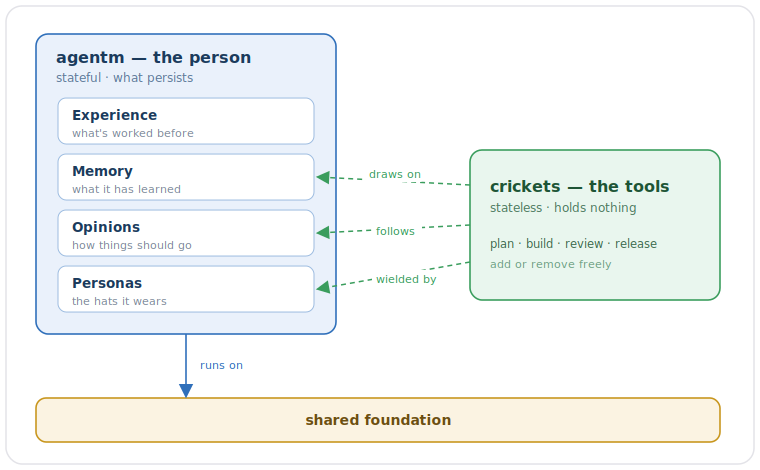

> [!NOTE]
> **LAUNCHED (2026-06-20).** The live shared-philosophy / foundations parent HLD, lifted into tracked `wiki/designs/` in AG Phase 2. This is the root the agentm and crickets HLDs point *up* at and inherit by reference.

# Foundations for a useful assistant
Artificial Intelligence, and by extension an Agent, must be useful to be worthwhile. Agents are gaining capabilities quickly through harnesses like Claude Code or Antigravity, but for these harnesses to be useful to the largest possible audience, they must by definition, appeal to large groups. So agents today are more versatile tools, and less personal, individualized extensions of the person using them.

A truly useful agent, one that acts as an extension of you, needs to think, remember and know you. To be engaging, it needs character and attitude. To be helpful, it needs to have opinions, and be capable of teaching what good 'looks like'. A truly useful agent feels natural to use, and isn't limited by its harness. 

Here we will discuss the foundations needed for an assistant (agent) that's truly useful, inspired by the assistants we've seen in the movies for years that talk, act and help naturally.

The bedrock the whole system stands on: the beliefs every part holds in common, and how the two halves — agentm (the person) and crickets (its tools) — relate. The agentm and crickets HLDs both point *up* at this doc and inherit it by reference instead of restating it.

## Overview - AgentM and Crickets

AgentM and Crickets represent one vision for a useful assistant. They work together to follow the principles laid out below. These principles are the foundation and inspiration for their designs. By building on this foundation, we get an AI agent that can do real engineering work — steadily, across many sessions, the way a careful engineer works over weeks. 

### Goals - What we're trying to achieve

- **Continuity** — the agent picks up where it left off, even though every session starts with no memory of the last.
- **Trust** — you can believe the output because it was checked.
- **Control** — the human stays in charge of anything hard to undo. The agent moves fast on what's reversible and stops at what isn't.
- **Durability** — the whole thing keeps working as the underlying models change, and stays cheap enough to run all day.

### Foundations - What we build to achieve them

To achieve our goals, we build our foundation around two ideas. A **person** and the **capabilities** they use to get the job done. The person provides persistence: they **remember**, gain **experience** over time, form **opinions** about how work should go, and they wear different hats (**personas**) as needed to do different jobs. The actual capabilities — planning, building, reviewing, releasing — are like tools that a person uses. Stateless by design, but more useful as that person gains experience in how to use them. 

## How agentm and crickets work together

agentm is the stateful person; crickets are its stateless tools. agentm holds everything that persists — the memory of what past sessions learned, the opinions about how work should go, the personas it puts on for different jobs. crickets holds each capability: plan, build, review, release, etc. — abilities the person picks up, uses, and sets down, carrying no state of its own between uses.

The relationship runs strictly one way. A tool or capability **draws on** agentm's memory (it recalls what earlier sessions wrote), **follows** agentm's opinions (the gates and conventions the substrate enforces), and is **wielded by** agentm's personas (i.e. architect, project-manager, tech-lead, engineer, reviewer are hats the person wears). While crickets may lean on agentm; agentm doesn't lean on crickets. Said differently, a bare agentm — the memory engine with no tools bolted on — is whole and runs on its own. The toolbox is the optional part, it can run on its own as well, but it's more **useful** when it depends on AgentM who knows how to use it correctly.

agentm and crickets are built off of this same, shared foundation, inheriting the same beliefs. 

## Principles

The principles that govern our implementation branch into three groups: shaping the work, trusting the work, and staying in control and current.

Each principle below includes an **explanation** about why we believe it, citations from **prior research and investigations** it is based on, and **examples** of how it shows up in the system (ratified by statements in Appendix A). Source paths are repo-qualified (`agentm:` / `crickets:`) or vault-relative; the full index is in [References](#references).

**P1 · Memory lives on disk, not in the conversation.**
Every session starts blank — on its own, the agent recalls nothing from last time. So anything worth keeping is written to a durable file and read back when the next session begins. Memory lives on disk, written as the agent works and recalled when it returns, the way a careful engineer trusts their notes over their recollection.
*Grounded in [`harness/principles.md`](#references).*

**P2 · Coherent work is grouped and owned.**
Work that has to hold together in one mind — building a feature, keeping a design straight — suffers when it's split across several hands at once. So each coherent piece has one owner that sees it through. Reading and research can fan out widely; the authoring stays with a single owner. In practice, one session works one task at a time, and the build stops a change that crosses ownership the wrong way.
*Grounded in [`harness/principles.md`](#references).*

**P3 · Checks before opinions.**
A test that runs tells you the truth; an AI's "looks good to me" only sounds like it does. So the agent trusts deterministic checks — types, lint, tests, build — ahead of any judgment, its own or another model's. The checks pass before anything counts as done, and a model's review sits on top of them.
*Grounded in [`scripts/check-all.sh`](#references).*

**P4 · Assume there are bugs.**
A reviewer only finds problems if it goes in expecting them. So review starts from the assumption that the work is flawed and hunts for the flaw — and it has to come back with something concrete, a failing test or an exact line, to count. A review that waves everything through is doing nothing.
*Grounded in [`adversarial-reviewer.md`](#references).*

**P5 · The human owns the irreversible.**
The agent should move fast on anything it can undo and stop on anything it can't. The line that matters is recoverability: a change you can roll back, it just makes; a change you can't — rewriting shared history, deleting the only copy of something — it pauses and hands to you. When the answer to "can this be undone?" is no, the human owns the call.
*Grounded in [`recoverability/SKILL.md`](#references).*

**P6 · Build from independent pieces that snap together.**
A part you can add or remove on its own is a part you can understand, test, and replace; one tangled whole is none of those. So the system is built from separate pieces that snap together — the memory engine stands alone, and each capability plugs on beside it, finding the others by name and carrying on when one is missing.
*Grounded in [agentm-hld](agentm-hld.md) — V5 unbundling call.*

**P7 · Prefer the simplest thing that works.**
Reach for the least machinery the job needs, and add more only when the work demands it. This shows up most in what we choose to leave out — splitting the toolbox out of the core, unbundling the phase loop — keeping each piece small enough to hold in your head.
*Grounded in [`harness/principles.md`](#references).*

**P8 · Re-check the scaffolding when the model changes.**
The whole harness is scaffolding shaped around how one model behaves. When the model changes, that shaping can quietly stop helping. So a new model is a cue to re-audit the scaffolding rather than carry it forward on faith — every decision record carries its own "re-check this if…" note for exactly that moment.
*Grounded in [`harness/principles.md`](#references).*

**P9 · Match the model to the work.**
A powerful model doing simple work spends the day's budget for nothing. So the heavy model is saved for planning and judgment, a lighter one runs the long mechanical stretches, and memory loads only what's warm enough to earn its cost. Done right, it's the difference between running for an hour and running all day.
*Grounded in [`heat_policy.py`](#references).*

*A note on the list:* "work in phases" isn't among these nine — running work in phases is how the person operates, so it lives in the [agentm HLD](agentm-hld.md), not in the shared foundation.

## How it all connects

All nine principles are shared — agentm and crickets stand on every one. But each has a natural home, the place it's mostly lived out. The person (agentm) is where memory, ownership, the checks, and model-routing sit. The tools (crickets) are where *assume there are bugs* and *the human owns the irreversible* turn into real behavior. And a middle group — building from independent pieces, keeping things simple, re-checking the scaffolding — belongs to both, because it's about how the whole thing is built.

These homes are centers of gravity with shared edges. *Checks before opinions* (P3) lives with the person — the checks are agentm's — yet it's a crickets tool, the review phase, that runs them. *The human owns the irreversible* (P5) shows up in a crickets safety gate, while its mirror on the memory side is agentm guarding each write. Where a principle is shared, the tool reaches up to the person for it.

## References

A single primary source per principle, grouped by where it lives today. Repo paths are relative to each repo root; vault paths are relative to `projects/agentm/_harness/` unless noted; ADRs by number. These point at today's evidence and will move as the code evolves — the principle is what's load-bearing, the citation just shows where it's grounded now.

**agentm repo**
- `harness/principles.md` — memory-on-disk (P1), single ownership (P2), the evaluator section (P3), simplest-thing (P7), re-audit (P8)
- `AGENTS.md` — state-on-disk (P1), single-thread + sub-agent rules (P2), checks-first (P3)
- `scripts/` — `harness_memory.py`, `vault_lock.py`, `harness/skills/memory/scripts/recall.py` (P1); `check-all.sh` (P3); `check-process-seam-import-direction.sh`, `queue_status_lite.py` (P2); `capability_resolver.py` (P6); `heat_policy.py` (P9)
- `wiki/reference/CI-Gates.md`, `Vault-Write-Protocol.md` (P1, P3); `wiki/explanation/Product-Intent.md` (P7, P8)
- [memory-storage-seam](memory-storage-seam.md) (P1: 0012/0013/0018/0019); [agentm-hld](agentm-hld.md) (P4: 0001, P6: 0011, P9: 0014); [agentm-foundations-hld](agentm-foundations-hld.md) (P6: 0006); ADR 0016 (P8: held)

**crickets repo**
- `src/code-review/agents/adversarial-reviewer.md`, `wiki/explanation/Why-Adversarial-Review.md` (P4)
- `src/developer-safety/skills/recoverability/SKILL.md` (P5, primary), `hooks/commit-on-stop/hook.md` (P5)
- `src/developer-workflows/commands/{work,bugfix,release,review}.md` (P4, P5)
- `wiki/designs/developer-plugin-suite.md` (P6)
- ADRs — 0002 (P4), 0013 / 0017 (P6), 0026 (P9)

**vault research** (`projects/agentm/`)
- `decisions/` — `autonomous-write-contract.md` (P1, P5), `research-concurrent-vault-writes.md` (P1), `research-multi-developer-vault.md` (P2), `memory-os-architecture-scan.md` (P6), `research-dream-mode-design.md` (P5), `research-token-efficiency-novel.md` (P9), `research-loop-engineering-autonomy.md` (P8)
- `_harness/` research + archives — `R08-storage-and-local-first.md` (P1), `R04-multi-agent-concurrency.md` (P2), `token-efficiency-46/` (P9), the recall-loop and heat-policy PLAN archives (P1, P9)

**global**
- `~/.claude/CLAUDE.md` — push / recoverability doctrine (P5), opusplan routing (P9)

## Amendment log

**2026-06-20 — authored, reviewed, and finalized.**

Authored 2026-06-19 from the ratified shared-philosophy Overview (design-doc Appendix A) and a two-round read-only grounding sweep (readers + a completeness critic), then taken through operator review to a vision-led voice. The nine principles **P1–P9** each carry a plain-English explanation and a single reference into the index; the three diagrams (relate, foundation-tree, synthesis) are hand-authored vector SVGs under `diagrams/`.

Key calls preserved through review: the agentm/crickets **primary-home banding** in the synthesis diagram (agentm carries P1/P2/P3/P9, jointly-held P6/P7/P8, crickets carries P4/P5); and the honesty flags — **P7** (simplest thing) is thinly-established, **P8** (re-check scaffolding) is manual discipline with no enforcing CI gate, and **P3**'s gate count is reconciled to **22** against `check-all.sh`. The generalized voice lessons from the operator's rewrite were captured in the always-load `docs-prose-style.md` and carried into the agentm + crickets passes.

**Approved 2026-06-20** (frontmatter `approved: 2026-06-20`); `status` stays `proposed` until the Phase-1 lift into tracked `wiki/designs/` flips it to `launched`. **Re-audit triggers:** flip `status` at the lift; re-confirm the primary-home banding against the agentm + crickets HLDs (they must not contradict it); re-count P3's gates if `check-all.sh` changes; the references are deliberately thin and expected to be replaced as the code moves.

**2026-06-24 — folded ADRs 0003 / 0005 / 0006 / 0008 into this design (AG Phase 4, move-and-retire).**

**0003 — GitHub ProjectsV2 ownership and linking (2026-04-21).** Two-call flow: create the issue, then `gh project item-add` to classify it. `@me` must be passed literally (not interpolatable by the CLI); the `repo` field is the audit anchor for cross-project tracing. Why not a single GQL call: GitHub's API has no one-shot create-and-classify; the two-call split is load-bearing, not convenience. *Re-audit trigger:* if GitHub adds one-shot create-and-classify to the GQL API.

**0005 — Drop Codex adapter support (2026-05-11).** Scope the adapter layer to three hosts — Claude / Gemini / Antigravity — at v1.0.0. The managed-parents wipe model is incompatible with Codex's execution model. Why not retain Codex: no active users; maintenance cost is disproportionate; three adapters cover the model-family diversity goal. *Re-audit trigger:* if Codex or an equivalent OpenAI-hosted agent executor re-enters active use.

**0006 — Crickets split: personal customizations into a sibling repo (2026-05-12).** Personal skills, sub-agents, hooks, slash commands, and the phase loop live in the sibling [`crickets`](https://github.com/alexherrero/crickets) repo. agentm exports byte-identical `lib/` and `install/` stubs. PII guardrails and the soft-dependency pattern (agentm works without crickets; crickets requires agentm) are the interface contract. Why not monorepo: agentm is the public harness; personal customizations are private; separation enforces the clean interface and prevents accidental PII leakage. *Cross-repo:* crickets side of this decision lives in the [Crickets HLD](https://github.com/alexherrero/crickets/wiki/crickets-hld). *Re-audit trigger:* if the soft-dependency pattern causes installation friction or the byte-identical stubs drift.

**0008 — Project surface split: agentm → #2, crickets → #5 (2026-06-03).** Two separate GitHub Projects boards; cross-repo dependencies expressed via the issue graph, not board membership; operator-personal issues stay in agentm#2. Why not a single board: the two projects have different audiences and lifecycles; one board hides crickets work behind agentm noise. *Cross-repo:* the crickets board and its depth convention live in the [Crickets GitHub Projects design](https://github.com/alexherrero/crickets/wiki/crickets-github-projects). *Re-audit trigger:* if the two boards diverge in tooling or the cross-repo issue graph becomes unmanageable.

**2026-06-20 — lifted + launched (AG Phase 2, A0/A1).** Lifted into tracked `wiki/designs/` and flipped `status: proposed → launched`. Stamped the AG governance frontmatter: `kind: design`, `scope: arc`, `area: shared/foundations` — **area-only, no `governs:`**: the shared-philosophy root governs no code (it's reached by area, not by file glob), per the [area taxonomy](Design-Governance). *Re-audit trigger satisfied:* status flipped at the lift. (Area reconciled 2026-06-21 from the placeholder `foundations`/`harness/principles.md` stamp to the canonical two-level vocab.)
