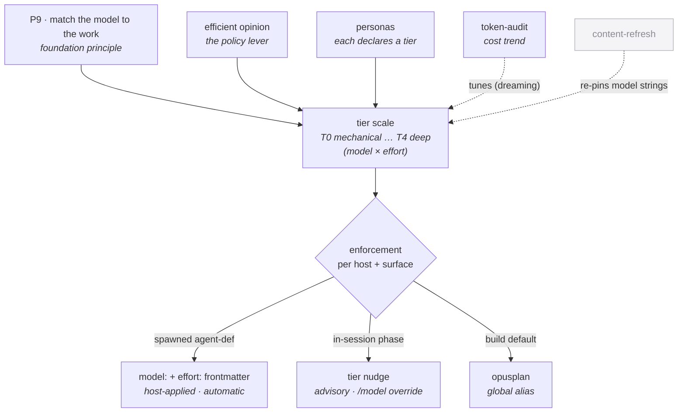

> [!NOTE]
> **LAUNCHED (lifted 2026-06-24, AG Phase 3; originally approved 2026-06-23).** child-design — **model + effort routing** (automatically binding a model + reasoning-effort *tier* to each persona/role, so the right brain runs each job without a per-session `/model`). A **cross-cutting** design, agentm-anchored. Points *up* at the [agentm HLD](agentm-hld.md).

# model + effort routing

## Objective

**Bind a model + reasoning-effort *tier* to each persona, and apply it automatically when that persona is adopted.** Research then runs on the strongest brain at the deepest setting, a long build stretch runs cheap, and nobody hand-sets `/model` per session. It is the concrete realization of foundation principle **P9 ("match the model to the work")** and of the **`efficient`** opinion's named *model-routing* lever. It is **not a plugin**: it is a policy (agentm), a per-persona binding (the persona manifest), and an enforcement surface (crickets agent-defs + the host).

## Overview

Routing collapses two dimensions — **model strength × reasoning effort** — into one ordered **tier scale**, because in practice they co-vary (harder work wants a stronger model *and* more thinking). A persona declares a tier; adoption applies it.

### The tier scale

| Tier | The work it fits | Effort | Claude Code | Gemini / Antigravity |
|---|---|---|---|---|
| **T4 · Deep** | research · adversarial audit · the hardest reasoning | `max` + orchestration | Opus 4.8, max, **ultracode** (multi-agent fan-out) | Gemini 3 Pro, deep-think (max) + agent fan-out |
| **T3 · Architect** | cross-system design · roadmap · priority / board calls | `max` | Opus 4.8, max | Gemini 3 Pro, max thinking |
| **T2 · Author** | planning · PM · design authoring · holding the technical bar | `high` | Opus 4.8, high | Gemini 3 Pro, high thinking |
| **T1 · Execute** | long autonomous build stretches | `medium` | `opusplan` (Opus plans → Sonnet 4.6 executes) | Gemini 3.5 Flash, high |
| **T0 · Mechanical** | rote edits · log-scraping · deterministic passes | `low` | Sonnet 4.6 / Haiku 4.5, low | Gemini 3.5 Flash (normal) |

*The model-version strings (and the Gemini column) are a **living mapping** — re-pinned on every model release by the [`content-refresh`](https://github.com/alexherrero/crickets/wiki/crickets-maintenance) primitive, never hand-cached. The effort ladder is `low · medium · high · max`; `ultracode` is the Claude-Code top-tier **orchestration mode**, not a fifth effort level.*

### Persona → tier

| Persona | Tier | Note |
|---|---|---|
| Researcher · Reviewer (audit) | **T4** | the hardest reasoning + adversarial breadth |
| Architect · Planner *(roadmap mode)* · Troubleshooter | **T3** | cross-system + priority calls |
| Designer · Tech-Lead · Planner *(planning/PM mode)* | **T2** | authoring + the technical bar |
| Engineer / Worker | **T1** | the long build stretch (`opusplan`) |
| Operator · Maintainer · Memory | **T0–T1** | read/report + mechanical repair |

*A persona's tier is its **default**; a mode-dependent persona escalates one tier for a genuinely harder sub-task (e.g. Planner → T3 for a roadmap call). The escalation is bounded by the persona's declared ceiling.*

*P9 + the `efficient` opinion set the policy; the personas declare tiers against the scale; enforcement renders a tier into a real model+effort per host and surface; token-audit's cost trend tunes the scale and content-refresh keeps its model strings current.*

## Design

### The policy — one tier scale, owned by `efficient`

The scale is the canonical artifact: each tier is a (model-class, effort) bundle named by intent. It realizes the **`efficient`** opinion's *model-routing* lever — `efficient` is "cheap as the job allows, above the quality floor," and the scale is how that judgment becomes a concrete pick. It implements foundation **P9**. The scale lives here so it is defined once; personas, the opinion, and the enforcement surface all reference it rather than restating model names.

### The binding — a tier axis on the persona manifest

The persona manifest gains a **`tier:`** field (and, where a persona spans modes, a `tier-ceiling:` for bounded escalation). This is the net-new axis: today the manifest declares stance · `enhances:` · `requires:` · opinions · modes · triggers, and **carries no model or effort at all**. Adding `tier:` makes "which brain this stance runs on" a declared, validated property (extending `check-personas.py`), not an operator habit. The persona roster gains the tier column shown above.

### Enforcement — three surfaces, by what the host can enforce

A tier becomes a real model+effort differently depending on how the persona is running:

- **Spawned sub-agent personas → automatic.** The agent-def carries `model:` (and the new `effort:`) frontmatter; the host applies it at spawn. This is the **as-built** mechanism (crickets `developer-workflows` already ships `model:` on `worker` / `researcher` / `tech-lead`) — generalized to the whole roster and extended with the effort axis.
- **In-session interactive personas → advisory.** A phase command surfaces the tier ("recommended: T2 · Author — Opus high; `/model` to override"). The host cannot enforce a slash-command's model, so this stays a nudge (the accepted limit the as-built routing already records).
- **Build default → `opusplan`.** The global `opusplan` alias (Opus plans, Sonnet executes) is the host-level realization of **T1 · Execute** for build sessions — a built-in two-tier split that covers the worker's plan/execute rhythm without per-step selection.

### Cross-host — Claude and Gemini

The tier is the portable unit; each host renders it through the chart. Claude Code renders via `model:` + effort + (at T4) `ultracode`; Antigravity/Gemini render via the Pro/Flash classes + a thinking budget. Where a host can't honor a dimension (e.g. an effort field it doesn't read), the tier degrades to the nearest model-only pick and the advisory nudge carries the rest — the same graceful-skip posture the rest of the portfolio uses.

### How token-audit feeds it

[token-audit](https://github.com/alexherrero/crickets/wiki/crickets-token-audit) is measurement-only and one-way: its designed auto-capture (a per-model `session-cost` record reviewed in the **dreaming** pass) surfaces when a persona is running hotter than its tier warrants — the longitudinal signal that **tunes** the scale and the persona→tier map over time. Routing decides; token-audit never picks a model.

## Dependencies & composition

- **composed by [personas](agentm-personas.md)** — each persona declares a `tier:`; this design owns the scale the field references.
- **realizes the [`efficient` opinion](agentm-opinions-and-gates.md)'s model-routing lever** and implements foundation **P9** ([agentm foundations HLD](agentm-foundations-hld.md)) — the policy altitude.
- **enforced through [development-lifecycle](https://github.com/alexherrero/crickets/wiki/crickets-development-lifecycle)** — its agent-defs carry the `model:`+`effort:` frontmatter the host applies; its phase commands carry the advisory tier nudge. The as-built precedent is that plugin's *phase-aware-model-routing*.
- **fed by [token-audit](https://github.com/alexherrero/crickets/wiki/crickets-token-audit)** — the cost trend that tunes the scale (one-way).
- **kept current by [`content-refresh`](https://github.com/alexherrero/crickets/wiki/crickets-maintenance)** — the chart is a **named item on its refresh checklist**: a model release auto-re-pins the chart's model-version strings + the Gemini column (mechanical), while a genuinely new model that needs a *tier* placement surfaces for operator review (judgment-bound). This is the standing answer to the chart decaying on model releases.
- **host-applied** — Claude Code (`model:` / effort / `opusplan` / `ultracode`) and Antigravity/Gemini (the equivalents column).
- Points up at the [agentm HLD](agentm-hld.md); the requires/enhances mechanics are in [crickets-composition](https://github.com/alexherrero/crickets/wiki/crickets-composition).

## Migrations

- **Generalize the as-built routing** — crickets *phase-aware-model-routing* binds `model:` to three roles today; lift it to the full persona roster and add the **effort axis** (net-new). The named model strings move behind the tier scale rather than being pinned per-command.
- **Add the manifest field** — `tier:` (+ `tier-ceiling:`) to the persona manifest schema + `check-personas.py`; add the roster column. (`[PENDING-IMPL]`.)
- **Point the touched designs here** — short pointer amendments in [personas](agentm-personas.md) (the `tier:` axis) and the [`efficient` opinion](agentm-opinions-and-gates.md) (its model-routing lever specified here). Per the AG track these are living-design amendments, not a new ADR.

## Risks & open questions

- **The whole thing is designed, not built** (`[PENDING-IMPL]`) — only the model-only, three-role as-built slice exists in crickets; the effort axis, the manifest field, the roster-wide binding, and the activation that reads it are greenfield (the persona "activation plumbing" is itself the unbuilt core).
- **In-session enforcement is advisory** — a host can't force a slash-command's model; `opusplan` + the nudge are the floor. Auto-enforcement only covers spawned sub-agents.
- **Effort-field host support varies** — Claude Code's effort/ultracode and Gemini's thinking budget are not the same control; the tier degrades gracefully where a dimension isn't honored.
- **The chart decays on model releases** — model-version strings + the Gemini column go stale; **`content-refresh` carries the chart as a named checklist item** (mechanical re-pin auto-applied; a new-model *tier* placement surfaces for review), and a model bump is also a P8 re-audit trigger.
- **Re-audit triggers:** add the `tier:` manifest field + validator; generalize the agent-def routing + add `effort:`; wire activation to apply the tier at adoption; wire `content-refresh` to re-pin the chart; re-pin the chart on every model release; confirm the persona→tier map against real `session-cost` trends once token-audit's capture ships.

## References

- **As-built precedent:** crickets `developer-workflows` *phase-aware-model-routing* — `agents/worker.md` (`model: claude-opus-4-8`), `researcher.md` / `tech-lead.md` (`claude-sonnet-4-6`); the phase-command advisory nudges; global `~/.claude/settings.json` `opusplan`
- **Principle + policy:** [agentm foundations HLD](agentm-foundations-hld.md) (P9 · match the model to the work) · [`efficient` opinion](agentm-opinions-and-gates.md) (the model-routing lever)
- **Binding + enforcement + feed:** [personas](agentm-personas.md) (the `tier:` axis) · [development-lifecycle](https://github.com/alexherrero/crickets/wiki/crickets-development-lifecycle) (agent-def frontmatter) · [token-audit](https://github.com/alexherrero/crickets/wiki/crickets-token-audit) (the cost trend) · [`content-refresh`](https://github.com/alexherrero/crickets/wiki/crickets-maintenance) (chart re-pin)
- **Up:** [agentm HLD](agentm-hld.md) · [composition](https://github.com/alexherrero/crickets/wiki/crickets-composition)

**2026-06-23 — authored, reviewed, and finalized.** Homed as **its own cross-cutting design, agentm-anchored** (not a plugin, not a single-doc amendment): the policy is the `efficient` opinion + foundation P9, the per-persona binding is a new `tier:` axis on the persona manifest, and enforcement spans crickets agent-defs + the host. Model + effort are normalized to a **five-tier scale** (T0 Mechanical … T4 Deep) with **Claude + Gemini equivalents** — T4–T2 on Opus / Gemini 3 Pro, T1 Execute on `opusplan` / Gemini 3.5 Flash high, T0 Mechanical on Sonnet-Haiku / Gemini 3.5 Flash normal (operator-set; on Gemini the bottom two tiers are one Flash model at differing effort, no Pro→Flash split) — plus a **persona→tier** map (research/audit→T4, roadmap→T3, planning/PM→T2, worker→T1).

The **net-new** pieces are all `[PENDING-IMPL]`: the **effort axis** (today's as-built crickets *phase-aware-model-routing* is model-only, three roles), the **`tier:` manifest field** + validator, roster-wide binding, and activation that applies the tier at adoption. token-audit feeds the tuning trend one-way; **`content-refresh` carries the chart as a named refresh-checklist item** — a model release auto-re-pins the version strings + Gemini column, while a genuinely new model's tier placement surfaces for review. **Next (wiring):** short pointer amendments into [personas](agentm-personas.md) (the `tier:` axis) + the [`efficient` opinion](agentm-opinions-and-gates.md) (the routing lever). **Re-audit:** add the `tier:` field + validator; generalize the agent-def routing + add `effort:`; wire activation + content-refresh; re-pin on every model release.
