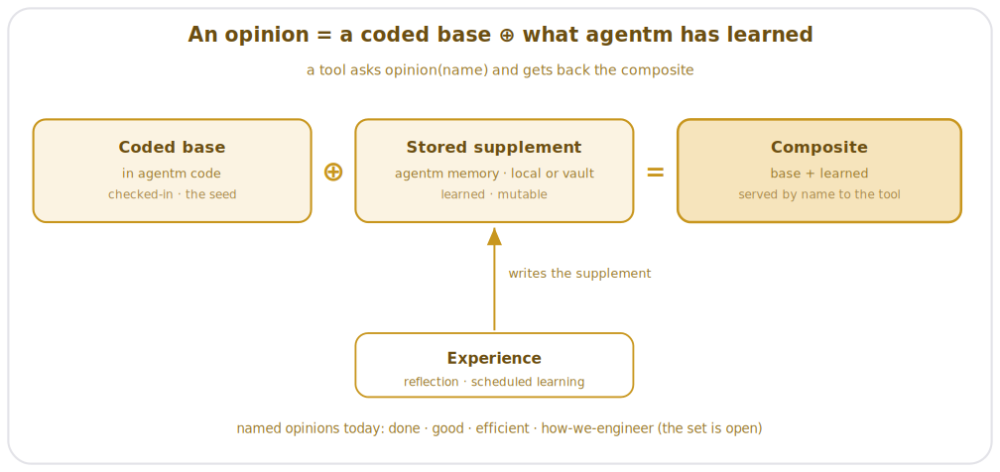

> [!NOTE]
> **LAUNCHED (lifted 2026-06-24, AG Phase 3; originally approved 2026-06-21).** child-design — the Opinions pillar, parent [agentm HLD](agentm-hld.md). One `[PENDING-IMPL]` (the compose-and-serve path) awaits implementation; `status: launched` (lifted into tracked `wiki/designs/` 2026-06-24, AG Phase 3).

# AgentM Opinions Design

## Objective

An opinion is **opinionated knowledge agentm holds, named so any tool can ask for it** — a standard for **how to work**. It answers a general question: what does *done*, *good*, or *efficient* mean? What does our engineering process look like? Holding the standard once, by name, buys three things:

- quality gets **checked**, not just asserted;
- one standard serves every caller;
- the standard sharpens over time across agents and tools, without refactoring.

## Overview

An opinion is deliberately **abstract** — knowledge that carries the standard; a capability asks for it by name and acts on what comes back.

Two things follow from keeping opinions abstract:

- **One opinion serves many tools.** The same *good* is asked for whether `/review`, a persona, or a future tool asks — defined once, named once.
- **An opinion sharpens without touching a tool.** Improve the standard and every caller that asks for it gets the better standard for free — this is where **Experience** feeds in over time (the [Experience design](agentm-experience-and-dreaming.md)).

Opinions are a **queryable knowledge surface** — a tool names what it needs and the substrate serves it.

## Design

Opinions are what make agentm **opinionated**: a standard for things like *done* / *good* / *efficient* / *how-we-engineer* (the full catalog is below) that the agent **ships with, in code**, and then **grows in agentm's memory as it learns**. The design folds this into existing seams — a coded base, a vault supplement, composed on request and served by name — rather than standing up a new store or recall path. The named opinions are listed at the end; this section is the system that holds and serves them.

### Where opinions live: a coded base, extended in agentm's memory

- **The base is in agentm's code, checked in.** Each opinion ships as a coded default — the standard the agent starts with. This is *why agentm is opinionated out of the box*: it already holds a view of what *done* / *good* / *efficient* / *how-we-engineer* mean. The base changes only by a check-in — it's the durable seed, the same for every install.
- **agentm's memory extends it — and this is the part that learns.** A supplement layer in **agentm's memory — whichever storage backend the agent is connected to (device-local or the vault), through the storage seam** — holds what the agent has *added* to a base opinion over time (an `opinions/` area beside the always-load conventions). **Experience** (reflection + scheduled learning) writes here; the agent never rewrites the coded base. This layer already exists in spirit — the learned conventions in `personal/_always-load/` are exactly this kind of stored, learned supplement to a coded standard.

### How a tool gets one: the composite

On request, agentm **folds the coded base ⊕ the vault supplement into one composite** and serves that. The tool gets the seed plus everything learned since, as a single opinion — it never sees the two layers, and a bare install (base only) or a seasoned one (base + a rich supplement) is served the same way.

Three things agentm already has carry this, so there is nothing new to invent:
- **By-name lookup** rides the seam crickets already uses to reach agentm — the one-way capability bridge (`find_capability.py` → `capability_resolver.py`); a thin `opinion` lookup rides the same path.
- **The base ⊕ overlay fold** is the pattern agentm's style system already uses — a base guide composed with a learned overlay (`style_resolver.py`); opinions compose the same way.
- **The supplement's storage, recall, and learning** is the memory engine ([Memory System](agentm-memory-system.md)).

**`[PENDING-IMPL]`** — wire the `opinion` lookup + the base ⊕ supplement fold onto those seams (documenter); today the base opinions are hardwired into the tools (e.g. `code-review` embeds *good*) and the stored supplement layer isn't built. The migration is the Opinion slice (design-doc Forward plan, Phase 3 → 4).

### The opinions today

The named opinions, listed like capabilities — what each holds, who asks for it, and just enough to fix its shape. The standard itself lives in the opinion entry, not here, and the set is **open** (these are today's).

| Opinion | What it holds | Serves | Shape |
|---|---|---|---|
| **done** | a completeness checklist | `/work`, `/release`, conventions gates | the check battery + the written conventions — *is it finished?* |
| **good** | a quality standard | `/review`, `code-review` | the adversarial-review contract — *does it survive a hostile read?* |
| **efficient** | a cost budget with a quality floor | `token-audit`, model routing, `/work` | cheap as the job allows, held above the *good* floor |
| **how we engineer** | the process discipline | `/plan`, `/work`, `design`, `/bugfix` | the phase discipline · the bugfix track · the plan → design → architecture sizing ladder |
| **recoverable** | the reversibility doctrine | `/work`, `/release`, `/bugfix`, the push gate | classify each action recoverable / unrecoverable — proceed on the recoverable, stop on the unrecoverable; *can it be undone?* (standard lives in `developer-safety`) |
| **private** | a leak floor | `development-lifecycle` finalize, CI, `diagnostics` | secrets + PII stay out of what's committed — *is it safe to commit / share?* (deterministic floor lives in `privacy`) |
| **ready** | a launch-readiness gate | `/launch` | metrics + alerts + a tested rollback + a flag off-switch + a staged rollout — *is it ready to ship to real users?* |
| **simple** | the simplest-thing-that-works standard | `/simplify`, `maintenance` | Chesterton's Fence + the Rule of 500 — *is any of this accidental complexity?* |
| **worth-knowing** | a relevance bar | `research`, Experience, the Researcher persona | *is this worth remembering, researching, or surfacing?* |

*(The phase discipline is agentm's; the phase commands are crickets' — the discipline-vs-tools split; see Dependencies. The full standard behind each opinion lives in its entry. **`efficient`'s model-routing lever is specified in [model + effort routing](agentm-model-effort-routing.md)** — the model × effort tier scale + persona→tier map that turns "cheap as the job allows" into a concrete model + effort pick.)*

## Dependencies

- **crickets touches by request, not by wiring.** A tool names the opinion it needs and runs its implementation: `/review` asks for *good* (runs the adversarial pass); `/release` and `/work` ask for *done* (run the check battery); any tool can ask for *efficient* or a process opinion. The crickets side of the wiring is the [composition design](https://github.com/alexherrero/crickets/wiki/crickets-composition).
- **Personas lean on opinions** — the "Leans on" column of the [Personas design](agentm-personas.md) names which surface each persona consults.
- **Experience feeds back** — reflection + scheduled learning sharpen the surfaces over time (the [Experience design](agentm-experience-and-dreaming.md)).
- **Points up at** the [agentm HLD](agentm-hld.md) §Opinions. The [V5 unbundling](agentm-hld.md) — phase commands moved to crickets — is why agentm owns the discipline while crickets owns the phase tools.

## Risks & open questions

- **The compose-and-serve path is designed, not built** — today each base opinion is hardwired into its tool (e.g. `code-review` embeds *good*); there is no stored supplement layer and no fold/lookup. The work: make the coded bases addressable opinions, add the stored supplement layer (in agentm's memory, whichever backend), and fold them on request through the existing bridge + style-overlay + memory seams. That code is specified by the [opinion registry](agentm-opinion-registry) design, which *governs* `opinion_resolver.py` once built; this pillar stays discipline/area-only. Marked `[PENDING-IMPL]` above.
- **Opinion versioning** — when a standard shifts (a new check joins the *done* battery), how do callers that cached the old standard adapt? Open.
- **The Experience → Opinions sharpening loop** — which experience signals sharpen which opinion, how often, and what keeps a bad signal from corrupting a standard — is designed, not specified.
- **Re-audit triggers:** flip the request-by-name API to as-built when the registry ships; specify the sharpening loop when forward learning lands.

## References

- **Coded bases (in agentm / its tools today):** `AGENTS.md` + `harness/principles.md` (conventions + engineering discipline) · `scripts/check-all.sh` + `wiki/reference/CI-Gates.md` (the *done* battery) · crickets `code-review` + `wiki/explanation/Why-Adversarial-Review.md` (the *good* contract) · `~/.claude/CLAUDE.md` opusplan + `heat_policy.py` (the *efficient* levers) · crickets `developer-workflows` (*how we engineer*)
- **Stored supplement (the learned layer):** agentm's memory — whichever backend it's connected to (device-local or the vault, via the seam); e.g. the learned conventions in `personal/_always-load/` (`docs-prose-style.md`)
- **The base ⊕ overlay precedent:** crickets `wiki-maintenance` `diataxis-author` — `style_resolver.py` composing `style/base-style-guide.md` with a learned overlay; opinions reuse this compose shape
- **The by-name seam:** `find_capability.py` → `capability_resolver.py` — the one-way bridge a thin `opinion` lookup rides

## Amendment log

**2026-06-26 — catalog expanded to nine; the resolver mechanism homed in its own design.** The opinions catalog grows from four to nine: added *recoverable* (the reversibility doctrine, provided by `developer-safety`), *private* (the leak floor, provided by `privacy`), *ready* (the launch-readiness gate), *simple* (the simplest-thing-that-works standard), and *worth-knowing* (the relevance bar the Researcher persona leans on). `recoverable` and `private` are promoted from sub-standards folded into other opinions to peer opinions; *voice* stays a prose-style overlay in `style_resolver`, not a catalog opinion. The request-by-name mechanism this pillar left as `[PENDING-IMPL]` is now specified by the new **[opinion registry](agentm-opinion-registry)** child design, which governs `opinion_resolver.py`; this pillar stays discipline/area-only. **Re-audit trigger:** revisit the catalog when a new surface is authored; flip the compose-and-serve `[PENDING-IMPL]` to as-built when the registry ships.

**2026-06-24 — pointed `efficient`'s model-routing lever at the routing design.** The `efficient` opinion names "model routing" as a lever it backs; that lever now has a concrete design — **[model + effort routing](agentm-model-effort-routing.md)** (the model × effort tier scale + persona→tier map + the `tier:` persona-manifest axis). Added a pointer from the opinions-table footnote; one-way (the opinion names the lever, the routing design specifies it). No change to the compose-and-serve model. **Re-audit trigger:** when the request-by-name registry ships, `efficient` returns the routing policy as part of its served composite.

**2026-06-21 — authored, reviewed, and finalized.**

Migrated from the agentm HLD and reframed through operator review into the Opinions pillar: opinions are what make agentm **opinionated** — a coded base (checked-in, the seed) **extended by a learned supplement in agentm's memory** (whichever storage backend it's connected to, device-local or the vault), folded into a **composite** served to a tool **by name**. The four named opinions (done / good / efficient / how-we-engineer) are listed like capabilities — shape only; each standard lives in its own opinion. The system reuses three existing seams — the capability-resolution bridge (by-name lookup), the style system's base⊕overlay compose (`style_resolver.py`), and the memory engine (the supplement) — rather than a new registry or recall.

Content-final. The compose-and-serve path is **designed, not built** (today the bases are hardwired into the tools; no stored supplement layer yet) — marked `[PENDING-IMPL]`; `status: launched` (lifted into tracked `wiki/designs/` 2026-06-24, AG Phase 3). **Re-audit triggers:** flip the compose/lookup to as-built when the Opinion slice ships; specify the Experience → Opinions sharpening loop when forward learning lands; settle opinion versioning.
