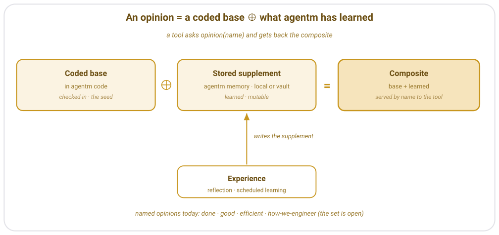

> [!NOTE]
> **LAUNCHED (lifted 2026-06-24, AG Phase 3; originally approved 2026-06-21) · locked 2026-06-28 (final AG design sweep).** child-design — the Opinions pillar, parent [agentm HLD](agentm-hld.md). The compose-and-serve path this pillar left `[PENDING-IMPL]` **shipped 2026-07-06** — see the [opinion registry](agentm-opinion-registry) design, which governs `opinion_resolver.py`; `status: launched` (lifted into tracked `wiki/designs/` 2026-06-24, AG Phase 3).

# AgentM Opinions Design

## Objective

An opinion is **opinionated knowledge agentm holds, named so any tool can ask for it** — a standard for **how to work**. It answers a general question: what does *done*, *good*, or *efficient* mean? What does our engineering process look like? Holding the standard once, by name, buys three things:

- quality gets **checked**, not just asserted;
- one standard serves every caller;
- the standard sharpens over time across agents and tools, without refactoring.

## Overview

An opinion is deliberately **abstract** — knowledge that carries the standard; a capability asks for it by name and acts on what comes back.

Two things follow from keeping opinions abstract:

- **One opinion serves many tools.** The same *good* is asked for whether `/review`, a persona, or a future tool asks — defined once, named once.
- **An opinion sharpens without touching a tool.** Improve the standard and every caller that asks for it gets the better standard for free — this is where **Experience** feeds in over time (the [Experience design](agentm-experience-and-dreaming.md)).

Opinions are a **queryable knowledge surface** — a tool names what it needs and the substrate serves it.

## Design

Opinions are what make agentm **opinionated**: a standard for things like *done* / *good* / *efficient* / *how-we-engineer* (the full catalog is below) that the agent **ships with, in code**, and then **grows in agentm's memory as it learns**. The design folds this into existing seams — a coded base, a vault supplement, composed on request and served by name — building entirely on the store and recall path that already exist. The named opinions are listed at the end; this section is the system that holds and serves them.

### Where opinions live: a coded base, extended in agentm's memory

- **The base is in agentm's code, checked in.** Each opinion ships as a coded default — the standard the agent starts with. This is *why agentm is opinionated out of the box*: it already holds a view of what *done* / *good* / *efficient* / *how-we-engineer* mean. The base changes only by a check-in — it's the durable seed, the same for every install.
- **agentm's memory extends it — and this is the part that learns.** A supplement layer in **agentm's memory — whichever storage backend the agent is connected to (device-local or the vault), through the storage seam** — holds what the agent has *added* to a base opinion over time (an `opinions/` area beside the always-load conventions). **Experience** (reflection + scheduled learning) writes here; the agent never rewrites the coded base. This layer already exists in spirit — the learned conventions in `personal/_always-load/` are exactly this kind of stored, learned supplement to a coded standard.

### How a tool gets one: the composite

On request, agentm **folds the coded base ⊕ the vault supplement into one composite** and serves that. The tool gets the seed plus everything learned since, as a single opinion — it never sees the two layers, and a bare install (base only) or a seasoned one (base + a rich supplement) is served the same way.

Three things agentm already has carry this, so there is nothing new to invent:
- **By-name lookup** rides the seam crickets already uses to reach agentm — the one-way capability bridge (`find_capability.py` → `capability_resolver.py`); a thin `opinion` lookup rides the same path.
- **The base ⊕ overlay fold** is the pattern agentm's style system already uses — a base guide composed with a learned overlay (`style_resolver.py`); opinions compose the same way.
- **The supplement's storage, recall, and learning** is the memory engine ([Memory System](agentm-memory-system.md)).

**Built (2026-07-06).** The `opinion` lookup + the base ⊕ supplement fold ship in `opinion_resolver.py` (see the [opinion registry](agentm-opinion-registry) design) — `opinion_resolve(name)` returns `served` / `base-only` / `no-opinion` / `error`, never raising. The nine coded bases ship as `opinions/<name>.md` stubs; the wirings that let a tool call `opinion_resolve` instead of its own hardwired copy flip one at a time as each consumer's own slice builds (the Opinion slice, design-doc Forward plan, Phase 3 → 4).

### The opinions today

The named opinions, listed like capabilities — what each holds, who asks for it, and just enough to fix its shape. The standard itself lives in the opinion entry, not here, and the set is **open** (these are today's).

| Opinion | What it holds | Serves | Shape |
|---|---|---|---|
| **done** | a completeness checklist | `/work`, `/release`, conventions gates | the check battery + the written conventions — *is it finished?* |
| **good** | a quality standard | `/review`, `code-review` | the adversarial-review contract — *does it survive a hostile read?* |
| **efficient** | a cost budget with a quality floor | `token-audit`, model routing, `/work` | cheap as the job allows, held above the *good* floor |
| **how we engineer** | the process discipline | `/plan`, `/work`, `design`, `/bugfix` | the phase discipline · the bugfix track · the plan → design → architecture sizing ladder |
| **recoverable** | the reversibility doctrine | `/work`, `/release`, `/bugfix`, the push gate | classify each action recoverable / unrecoverable — proceed on the recoverable, stop on the unrecoverable; *can it be undone?* (standard lives in `developer-safety`) |
| **private** | a leak floor | `development-lifecycle` finalize, CI, `diagnostics` | secrets + PII stay out of what's committed — *is it safe to commit / share?* (deterministic floor lives in `privacy`) |
| **ready** | a launch-readiness gate | `/launch` | metrics + alerts + a tested rollback + a flag off-switch + a staged rollout — *is it ready to ship to real users?* |
| **simple** | the simplest-thing-that-works standard | `/simplify`, `maintenance` | Chesterton's Fence + the Rule of 500 — *is any of this accidental complexity?* |
| **worth-knowing** | a relevance bar | `research`, Experience, the Researcher persona | *is this worth remembering, researching, or surfacing?* |

*(The phase discipline is agentm's; the phase commands are crickets' — the discipline-vs-tools split; see Dependencies. The full standard behind each opinion lives in its entry. **`efficient`'s model-routing lever is specified in [model + effort routing](agentm-model-effort-routing.md)** — the model × effort tier scale + persona→tier map that turns "cheap as the job allows" into a concrete model + effort pick.)*

### How the supplement grows: the accumulate loop — built

**Condensed twin of the fuller section in the [Experience design](agentm-experience-and-dreaming.md#the-experience--opinions-accumulate-loop--built)** (spec landed 2026-07-07 from `ACCUMULATE-LOOP-SPEC-DRAFT.md`; Stage 1 built v9.1.0; Stages 2-3 designed to ten locked calls 2026-07-25 and built the same day, [PR #380](https://github.com/alexherrero/agentm/pull/380)). The one-sentence design: the accumulate loop is the style-learning loop generalized from voice to standards — the same edit-driven, operator-gated capture the wiki system already proved, with a recurrence gate in front and the coded base as an unoverridable floor behind.

- **Route, don't invent** *(built)*. No new pipeline — a routing rule inside the existing capture paths targets an opinion supplement when a candidate is standard-shaped. `opinion_routing.py` classifies deterministically from the candidate's own text and writes to a per-opinion lane at `personal/_opinions/<name>/`; nothing is ever written into a coded `opinions/*.md`.
- **The signal → opinion map is retired.** It keyed on sources that emit nothing machine-readable, three of the four living in crickets rather than agentm. Text-shape classification is the sole classifier; Stage 1's existing optional `source:` field records origin as provenance, never as a routing key. Voice and prose lessons stay in the style overlay and are never double-captured here.
- **Three anti-corruption guards, each with its mechanism.** A recurrence gate — the same lesson from two **distinct** sessions, matched at 0.85 similarity within one opinion's lane, which is its own store. Extend-never-override — a suspected contradiction parks rather than serving, and surfaces as a proposed base change through the cycle digest, `_meta/opinion-base-proposals.json`, and the console; applying one means editing the base by hand. Provenance — `sessions:`, optional `refs:`, and the existing `supersedes:` chain, reported by a supplement-health check on the `memory freshness+experience` axis.
- **Cadence:** capture continuous; promotion runs as one new dreaming stage, confirm-gated through a supervised first window before any auto-apply ruling; maintenance stays dreaming's — named owner, no second mechanism.

**As-built (2026-07-25, [PR #380](https://github.com/alexherrero/agentm/pull/380)).** Stages 2-3 shipped as one new dreaming stage plus a stdlib-only leaf module (`opinion_supplement.py`): the recurrence gate, contradiction check, composition, the `kind: opinion-supplement` registration, the `_opinions/` dreaming exclusion, and the health surface (`verify-opinion-supplements.sh` in `check-all.sh` + CI). Promotion stays confirm-gated — `opinion_promote` is not in `AUTO_APPLY_STAGES` until a fresh operator ruling — and the 0.85 / ~20-entry calibration numbers wait on real lane volume, which is zero today. **No change to the compose-and-serve model above** — the accumulate loop is entirely how the supplement *fills*, not how it's served, and composition writes the served `<name>.md` at exactly the path `opinion_resolver._read_supplement` already reads, so the resolver is untouched.

## Dependencies

- **crickets touches by request, not by wiring.** A tool names the opinion it needs and runs its implementation: `/review` asks for *good* (runs the adversarial pass); `/release` and `/work` ask for *done* (run the check battery); any tool can ask for *efficient* or a process opinion. The crickets side of the wiring is the [composition design](https://github.com/alexherrero/crickets/wiki/crickets-composition).
- **Personas lean on opinions** — the "Leans on" column of the [Personas design](agentm-personas.md) names which surface each persona consults.
- **Experience feeds back** — reflection + scheduled learning sharpen the surfaces over time (the [Experience design](agentm-experience-and-dreaming.md)).
- **Points up at** the [agentm HLD](agentm-hld.md) §Opinions. The [V5 unbundling](agentm-hld.md) — phase commands moved to crickets — is why agentm owns the discipline while crickets owns the phase tools.

## Risks & open questions

- **The compose-and-serve path shipped 2026-07-06.** The coded bases are addressable opinions (`opinions/*.md` stubs), the stored supplement layer folds on request through `opinion_resolver.py` (a resolver pattern mirroring `governs_resolver.py` — pure, one-way, never-raise). That code is specified by, and governed by, the [opinion registry](agentm-opinion-registry) design; this pillar stays discipline/area-only. **What's left:** each hardwired consumer (`code-review` embedding *good*, etc.) still flips to calling `opinion_resolve` one at a time as its own slice builds — the registry existing doesn't retrofit every caller at once.
- **Opinion versioning** — when a standard shifts (a new check joins the *done* battery), how do callers that cached the old standard adapt? Open.
- **The accumulate loop is built end-to-end.** The routing rule is real code as of v9.1.0; the recurrence gate, contradiction detection, the provenance schema, composition, and the health check shipped 2026-07-25 ([PR #380](https://github.com/alexherrero/agentm/pull/380)), implemented against the ten locked calls (see the section above; full version in the [Experience design](agentm-experience-and-dreaming.md)). The signal → opinion map is retired — it keyed on sources that emit nothing machine-readable. Deliberately open: promotion stays confirm-gated until a fresh operator auto-apply ruling, and the 0.85 / ~20-entry calibration numbers are unmeasured — the lane is empty on the real vault today.
- **Re-audit triggers:** flip the request-by-name API to as-built when the registry ships; re-audit the accumulate loop's calibration numbers once real lane volume exists, and record the `opinion_promote` auto-apply ruling in the [Experience design](agentm-experience-and-dreaming.md)'s amendment log when the operator makes it.

## References

- **Coded bases (in agentm / its tools today):** `AGENTS.md` + `harness/principles.md` (conventions + engineering discipline) · `scripts/check-all.sh` + `wiki/reference/CI-Gates.md` (the *done* battery) · crickets `code-review` + `wiki/explanation/Why-Adversarial-Review.md` (the *good* contract) · `~/.claude/CLAUDE.md` opusplan + `heat_policy.py` (the *efficient* levers) · crickets `developer-workflows` (*how we engineer*)
- **Stored supplement (the learned layer):** agentm's memory — whichever backend it's connected to (device-local or the vault, via the seam); e.g. the learned conventions in `personal/_always-load/` (`docs-prose-style.md`)
- **The base ⊕ overlay precedent:** crickets `wiki` `diataxis-author` — `style_resolver.py` composing `style/base-style-guide.md` with a learned overlay; opinions reuse this compose shape
- **The by-name seam:** `find_capability.py` → `capability_resolver.py` — the one-way bridge a thin `opinion` lookup rides
- **The accumulate loop's full spec:** the [Experience design](agentm-experience-and-dreaming.md) § The Experience → Opinions accumulate loop; original source draft at vault `_harness/designs/architecture-governance/ACCUMULATE-LOOP-SPEC-DRAFT.md`

## Amendment log

**2026-07-25 — Stages 2-3 built; the twin's marker flips to as-built ([PR #380](https://github.com/alexherrero/agentm/pull/380), same-day follow-on to the design pass below).** All ten locked calls implemented verbatim: `opinion_supplement.py` (the recurrence gate at 0.85 over per-opinion lanes, two distinct sessions to promote; the narrow direct-negation contradiction check; whole-lane composition), the `_stage_opinion_supplement()` dreaming stage staging confirm-gated `opinion_promote` proposals through the existing revert-log path, the `KNOWN_KINDS` registration, the `_opinions/` dreaming exclusion, and the health surface on the `memory freshness+experience` axis (`verify-opinion-supplements.sh`, wired into `check-all.sh` + CI). One field-name reconciliation, ruled in the [Experience design](agentm-experience-and-dreaming.md)'s own 2026-07-25 as-built amendment: the design pass's `signal_source:` is Stage 1's existing `source:` field — same meaning, an optional origin tag serving as provenance only — so the build kept the one field and this twin now names `source:`. The compose-and-serve model stays untouched, exactly as the design promised: composition writes the served `<name>.md` at the path `opinion_resolver._read_supplement` already reads. *Re-audit trigger:* the 0.85 / ~20-entry calibration numbers once real lane volume exists; the auto-apply ruling stays open by design (call 9) and `opinion_promote` joins `_ANOMALY_WATCHED_STAGES` when it is made.

**2026-07-25 — the accumulate loop's Stages 2-3 get an implementable design; condensed twin reconciled (design pass, no code).** Primary home is the [Experience design](agentm-experience-and-dreaming.md#the-experience--opinions-accumulate-loop--built), where the ten locked calls and their why-not-the-alternative reasoning live; this twin carries the four-bullet summary. Two changes matter here. **The signal → opinion map is retired** (operator ruling) — it keyed on sources that emit nothing machine-readable, three of the four living in crickets, so text-shape classification is the sole classifier and an optional `signal_source:` field records origin as provenance only. **Promotion is confirm-gated through a supervised first window** (operator ruling) before any auto-apply, since a served supplement is text the agent reads as its own standard. The rest of the twin gains the mechanism behind each guard: the recurrence gate matches at 0.85 within one opinion's per-opinion lane and needs two *distinct* sessions; a suspected contradiction parks and surfaces as a base-change proposal through the digest, `_meta/opinion-base-proposals.json`, and the console; provenance is `sessions:` + optional `refs:` + the existing `supersedes:` chain, reported on the `memory freshness+experience` health axis rather than the "opinions family" the spec named, which does not exist. **Nothing changes in the compose-and-serve model above** — composition writes the served `<name>.md` at exactly the path `opinion_resolver._read_supplement` already reads, so the resolver stays stdlib-only and untouched. *Re-audit trigger:* flip the `[PENDING-IMPL]` once Stages 2-3 build.

**2026-07-07 — the Experience → Opinions accumulate loop spec landed, condensed twin, design amendment only (`PLAN-wave-e-experience` task 3, SPEC-FIRST).** Lands the condensed twin of `ACCUMULATE-LOOP-SPEC-DRAFT.md`'s contract here (full version in the [Experience design](agentm-experience-and-dreaming.md), the amendment's primary home) — the operator explicitly approved a go/no-go on the draft before this landing. New subsection "How the supplement grows: the accumulate loop" added after the opinions table: route-don't-invent, the signal→opinion map, the three anti-corruption guards (recurrence gate, extend-never-override, provenance-or-it-didn't-happen), and the cadence (continuous capture, gated promotion, maintenance delegated to dreaming's whole-corpus pass — no second mechanism). Landed verbatim, no redesign. **No code ships in this task** — the routing rule, signal map, and guards are all `[PENDING-IMPL]`, deferred to a follow-on plan. This closes the "designed, not specified" gap the 2026-06-21/2026-06-24 entries below both named as open. *Re-audit trigger:* flip this note's `[PENDING-IMPL]` once the follow-on implementation plan lands.

**2026-07-06 — compose-and-serve `[PENDING-IMPL]` flipped to as-built (AG Wave B leader 2/5).** The request-by-name registry this pillar left open ships in `opinion_resolver.py` + `agentm-opinion.sh`, governed by the [opinion registry](agentm-opinion-registry) design. This pillar's own content (the nine-opinion catalog, the "opinions today" table) needed no change — it already named all nine as of the 2026-06-26 amendment. What's left is per-consumer: each hardwired tool flips to `opinion_resolve` one at a time. *Re-audit trigger:* note when the last hardwired consumer flips.

**2026-06-28 — lock-down sweep (operator review).** Sized the diagram (`width`/`height`); confirmed the nine-opinion catalog + the request-by-name model. Log already newest-first. Locked as a v5–v8 guidepost.

**2026-06-26 — catalog expanded to nine; the resolver mechanism homed in its own design.** The opinions catalog grows from four to nine: added *recoverable* (the reversibility doctrine, provided by `developer-safety`), *private* (the leak floor, provided by `privacy`), *ready* (the launch-readiness gate), *simple* (the simplest-thing-that-works standard), and *worth-knowing* (the relevance bar the Researcher persona leans on). `recoverable` and `private` are promoted from sub-standards folded into other opinions to peer opinions; *voice* stays a prose-style overlay in `style_resolver`, not a catalog opinion. The request-by-name mechanism this pillar left as `[PENDING-IMPL]` is now specified by the new **[opinion registry](agentm-opinion-registry)** child design, which governs `opinion_resolver.py`; this pillar stays discipline/area-only. **Re-audit trigger:** revisit the catalog when a new surface is authored; flip the compose-and-serve `[PENDING-IMPL]` to as-built when the registry ships.

**2026-06-24 — pointed `efficient`'s model-routing lever at the routing design.** The `efficient` opinion names "model routing" as a lever it backs; that lever now has a concrete design — **[model + effort routing](agentm-model-effort-routing.md)** (the model × effort tier scale + persona→tier map + the `tier:` persona-manifest axis). Added a pointer from the opinions-table footnote; one-way (the opinion names the lever, the routing design specifies it). No change to the compose-and-serve model. **Re-audit trigger:** when the request-by-name registry ships, `efficient` returns the routing policy as part of its served composite.

**2026-06-21 — authored, reviewed, and finalized.**

Migrated from the agentm HLD and reframed through operator review into the Opinions pillar: opinions are what make agentm **opinionated** — a coded base (checked-in, the seed) **extended by a learned supplement in agentm's memory** (whichever storage backend it's connected to, device-local or the vault), folded into a **composite** served to a tool **by name**. The four named opinions (done / good / efficient / how-we-engineer) are listed like capabilities — shape only; each standard lives in its own opinion. The system reuses three existing seams — the capability-resolution bridge (by-name lookup), the style system's base⊕overlay compose (`style_resolver.py`), and the memory engine (the supplement) — with no new registry or recall path required.

Content-final. The compose-and-serve path **shipped 2026-07-06** (see the [opinion registry](agentm-opinion-registry) design); `status: launched` (lifted into tracked `wiki/designs/` 2026-06-24, AG Phase 3). **Re-audit triggers:** flip each hardwired consumer to `opinion_resolve` as its own slice builds; specify the Experience → Opinions sharpening loop when forward learning lands; settle opinion versioning.
